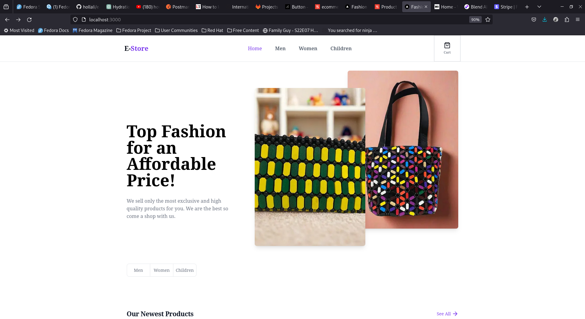

 E-Commerce Website

This is an e-commerce website built with Next.js, TypeScript,  Tailwind CSS, Shadow, Stripe or Paystack for payments, and Sanity for content management.
Getting Started




To get started with this project, follow these steps:

    Clone the repository:

    bash

git clone https://github.com/hollali/e-store.git

Install dependencies:

bash

cd e-store
npm install

Set up environment variables:

    Copy the .env.example file to .env.local and fill in your environment variables.

Start the development server:

bash

    npm run dev

    Open http://localhost:3000 in your browser to see the website.

Tech Stack

    Frontend: Next.js, TypeScript, Tailwind CSS, Shadow, Shadcn
    Payments: Stripe, Paystack
    Content Management: Sanity

Features

    Responsive design using Tailwind CSS.
    Product management and inventory control.
    Secure payments with Stripe and Paystack integration.
    Content management with Sanity.
    User authentication and authorization.
    Order tracking and management.

Contributing

Contributions are welcome! Please fork the repository and submit a pull request with your changes.
License

This project is licensed under the MIT License - see the LICENSE file for details.


---------------------


### Step 1: Set Up Paystack Account
1. **Sign up**: Create an account on Paystack if you haven't already.
2. **Get API Keys**: Navigate to the dashboard to get your public and secret keys.

### Step 2: Install Necessary Packages
Install `axios` to handle HTTP requests and `react-paystack` to integrate Paystack's payment gateway in your React components.

```bash
npm install axios react-paystack
```

### Step 3: Create the Payment Component
Create a file named `PaystackPayment.js` in your components directory.

```jsx
// components/PaystackPayment.js
import React from 'react';
import { PaystackButton } from 'react-paystack';

const PaystackPayment = ({ email, amount, onSuccess, onClose }) => {
  const publicKey = process.env.NEXT_PUBLIC_PAYSTACK_PUBLIC_KEY;

  const componentProps = {
    email,
    amount: amount * 100, // Convert to kobo
    publicKey,
    text: 'Pay Now',
    onSuccess,
    onClose,
  };

  return (
    <div>
      <PaystackButton {...componentProps} />
    </div>
  );
};

export default PaystackPayment;
```

### Step 4: Create Environment Variables
Create a `.env.local` file in the root of your project and add your Paystack public key.

```env
NEXT_PUBLIC_PAYSTACK_PUBLIC_KEY=your_paystack_public_key
NEXT_PUBLIC_PAYSTACK_SECRET_KEY=your_paystack_secret_key
```

### Step 5: Create Checkout Page
Create a new page for the checkout process in `pages/checkout.js`.

```jsx
// pages/checkout.js
import React, { useState } from 'react';
import PaystackPayment from '../components/PaystackPayment';
import axios from 'axios';

const Checkout = () => {
  const [email, setEmail] = useState('');
  const [amount, setAmount] = useState(0);

  const handleSuccess = (reference) => {
    console.log(reference);

    // Handle success (e.g., save transaction details in your database)
  };

  const handleClose = () => {
    console.log('Transaction was closed');
  };

  return (
    <div>
      <h1>Checkout</h1>
      <input
        type="email"
        placeholder="Enter your email"
        value={email}
        onChange={(e) => setEmail(e.target.value)}
      />
      <input
        type="number"
        placeholder="Enter amount"
        value={amount}
        onChange={(e) => setAmount(e.target.value)}
      />
      <PaystackPayment
        email={email}
        amount={amount}
        onSuccess={handleSuccess}
        onClose={handleClose}
      />
    </div>
  );
};

export default Checkout;
```

### Step 6: Verify Payment
Create an API route to verify the payment with Paystack in `pages/api/verifyPayment.js`.

```jsx
// pages/api/verifyPayment.js
import axios from 'axios';

export default async function handler(req, res) {
  if (req.method === 'POST') {
    const { reference } = req.body;

    try {
      const response = await axios.get(
        `https://api.paystack.co/transaction/verify/${reference}`,
        {
          headers: {
            Authorization: `Bearer ${process.env.NEXT_PUBLIC_PAYSTACK_SECRET_KEY}`,
          },
        }
      );

      if (response.data.data.status === 'success') {
        res.status(200).json({ success: true, data: response.data.data });
      } else {
        res.status(400).json({ success: false, message: 'Payment not successful' });
      }
    } catch (error) {
      res.status(500).json({ success: false, message: error.message });
    }
  } else {
    res.status(405).json({ message: 'Method Not Allowed' });
  }
}
```

### Step 7: Update Checkout Success Handler
Modify the `handleSuccess` function in `pages/checkout.js` to verify the payment with your API.

```jsx
// pages/checkout.js
import React, { useState } from 'react';
import PaystackPayment from '../components/PaystackPayment';
import axios from 'axios';

const Checkout = () => {
  const [email, setEmail] = useState('');
  const [amount, setAmount] = useState(0);

  const handleSuccess = async (reference) => {
    console.log(reference);

    try {
      const response = await axios.post('/api/verifyPayment', {
        reference: reference.reference,
      });

      if (response.data.success) {
        console.log('Payment verified successfully', response.data.data);
        // Handle successful verification (e.g., save transaction details in your database)
      } else {
        console.log('Payment verification failed', response.data.message);
      }
    } catch (error) {
      console.error('Error verifying payment', error);
    }
  };

  const handleClose = () => {
    console.log('Transaction was closed');
  };

  return (
    <div>
      <h1>Checkout</h1>
      <input
        type="email"
        placeholder="Enter your email"
        value={email}
        onChange={(e) => setEmail(e.target.value)}
      />
      <input
        type="number"
        placeholder="Enter amount"
        value={amount}
        onChange={(e) => setAmount(e.target.value)}
      />
      <PaystackPayment
        email={email}
        amount={amount}
        onSuccess={handleSuccess}
        onClose={handleClose}
      />
    </div>
  );
};

export default Checkout;
```

### Step 8: Test Your Integration
Run your Next.js app and navigate to the checkout page. Test the payment process using Paystack's test card details to ensure everything works correctly.

### Summary
1. **Set up Paystack account and obtain API keys.**
2. **Install necessary packages (`axios` and `react-paystack`).**
3. **Create a payment component (`PaystackPayment.js`).**
4. **Add environment variables (`.env.local`).**
5. **Create a checkout page (`checkout.js`).**
6. **Create an API route to verify payments (`verifyPayment.js`).**
7. **Update the checkout success handler to verify payments.**
8. **Test the integration.**

